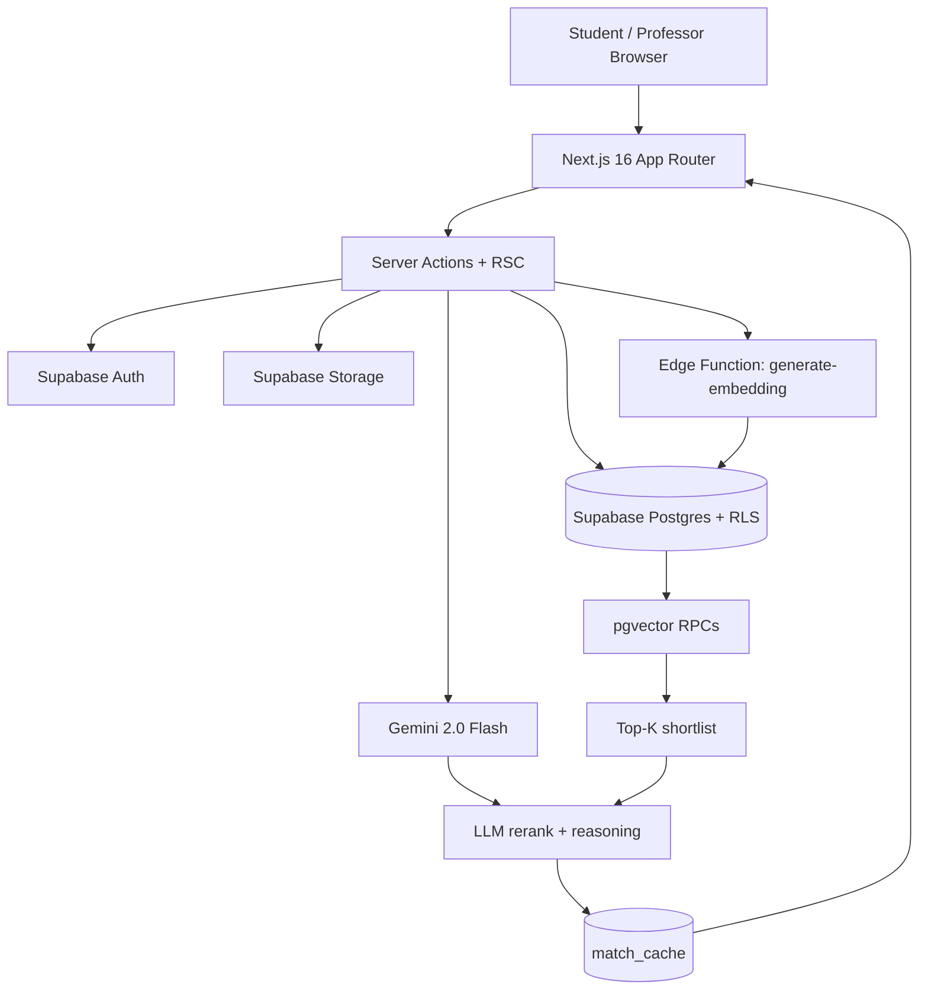
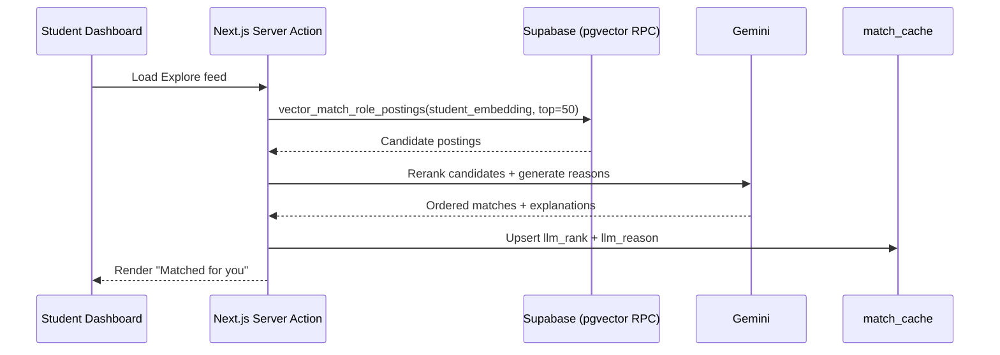
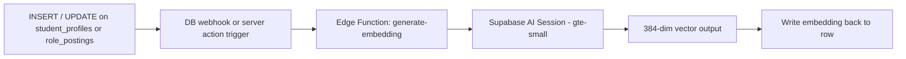

# LabLink

> AI-powered research matchmaking for students and university labs.

LabLink is a research marketplace platform ("LinkedIn for research positions") built for Convergent Demo Day (Social Impact case). We help students discover high-fit lab opportunities and help professors review applicants with context-aware AI support.

## 🌐 Links

- GitHub: [https://github.com/rohansarakinti/lablink](https://github.com/rohansarakinti/lablink)
- Figma: [https://www.figma.com/design/xDPTdqHpG3BPq7iVTQXKq2/Sustainability---SP26-TX-Convergent-File-Template?node-id=2001-4&m=dev&t=D1quCeSyJLrdW4di-1](https://www.figma.com/design/xDPTdqHpG3BPq7iVTQXKq2/Sustainability---SP26-TX-Convergent-File-Template?node-id=2001-4&m=dev&t=D1quCeSyJLrdW4di-1)

## ✨ Why This Is Different

Traditional discovery is keyword-heavy and noisy. LabLink uses a **two-stage semantic pipeline** to maximize quality while controlling cost:

1. **Stage 1 (fast retrieval):** pgvector ANN search in Postgres shortlists top role postings.
2. **Stage 2 (smart rerank):** Gemini reranks only that shortlist and generates match reasoning.

Result: students get meaningful, context-aware recommendations without paying LLM cost on every posting.

## 🧠 Core Features

- 🤖 **AI role matching (2-stage)**
  - Embeds `student_profiles` + `role_postings` with Supabase `gte-small` (384-dim).
  - Reranks top candidates with Gemini and stores results in `match_cache`.
- 📄 **Resume/CV AI autofill**
  - Extracts text with `pdfjs-dist`.
  - Uses Gemini to parse structured onboarding fields.
- 🧪 **Lab lifecycle management**
  - Professors create labs, publish roles, and manage applicants/member permissions.
- 🔎 **Semantic search**
  - Converts query text to embedding via Edge Function (`query_embed`) and reranks results.
- ⚙️ **Embedding pipeline**
  - Supabase Edge Function updates embeddings on insert/update events.
- 🧭 **Guided onboarding**
  - Multi-step student/professor onboarding with draft persistence and atomic submit.
- 📊 **AI-assisted applicant review**
  - "Recommended" ranking for professor applicant workflows with fit rationale.

## 🏗️ Architecture Diagram



## 🔄 Matching Workflow



## 🔌 Embedding Pipeline Workflow



## 🧰 Tech Stack

- 🎨 **Frontend:** Next.js 16, React 19, Tailwind CSS v4
- 🗄️ **Backend:** Supabase (Postgres, Auth, Storage, Realtime, Edge Functions)
- 🧮 **Vector retrieval:** pgvector (HNSW ANN + RPC)
- 🧠 **LLM:** Google AI Studio Gemini (rerank + autofill extraction)
- 🚀 **Hosting:** Vercel
- 📄 **Document parsing:** `pdfjs-dist`

## 🗂️ Project Structure

```text
app/                    # Routes, layouts, dashboards, onboarding, lab flows
components/             # Reusable UI components
lib/                    # Supabase clients, matching logic, onboarding helpers
supabase/migrations/    # SQL schema, RLS, vector RPCs
supabase/functions/     # Edge Functions (embedding generation)
scripts/                # Utility scripts (embedding backfill, demo reset)
docs/                   # Implementation docs + seed personas
```

## 🚀 Quick Start

### 1) Install dependencies

```bash
npm install
```

### 2) Create `.env.local`

```bash
NEXT_PUBLIC_SUPABASE_URL=...
NEXT_PUBLIC_SUPABASE_ANON_KEY=...
GOOGLE_AI_STUDIO_API_KEY=...
```

### 3) Configure Edge Function secret

```bash
supabase secrets set SUPABASE_SERVICE_ROLE_KEY=...
```

### 4) Run migrations + seed

```bash
supabase db reset
```

The project is configured to run `supabase/seed.sql` automatically after migrations.

### 5) Start development server

```bash
npm run dev
```

Open `http://localhost:3000`.

## 🧪 Demo Accounts (Seeded)

Use after migrations + seed:

- 👩‍🎓 Student: `anushka.bakshi@lablink-demo.test` / `SeedPass123!`
- 👨‍🏫 Professor: `professor.smith@lablink-demo.test` / `SeedPass123!`

## 🛠️ Useful Scripts

- `npm run dev` - start dev server
- `npm run build` - production build
- `npm run start` - run production server
- `npm run lint` - lint project
- `npm run backfill:embeddings` - backfill embeddings for existing records
- `npm run reset:anushka-smith` - reset demo application state for live skit

## 🔍 Technical Review Map (for judges/reviewers)

### AI Matching Pipeline

- `app/dashboard/student/page.tsx`
- `lib/matching/rank-matches.ts`
- `supabase/migrations/20260422120000_vector_match_by_embedding.sql`
- `supabase/migrations/20260423120000_vector_match_students_for_posting.sql`
- `supabase/migrations/20260421120040_match_cache_student_writes.sql`

### Resume/CV Autofill

- `app/onboarding/autofill-actions.ts`
- `lib/onboarding/parse-onboarding-file.ts`
- `lib/onboarding/extract-text-from-file.ts`

### Lab Management + Applicant Flows

- `app/labs/new/actions.ts`
- `app/labs/[labId]/page.tsx`
- `app/labs/[labId]/public-profile/actions.ts`
- `app/labs/[labId]/postings/new/page.tsx`
- `app/labs/[labId]/postings/[postingId]/applicants/page.tsx`
- `supabase/migrations/20260421120010_lab_management_foundation.sql`

### Semantic Search + Embeddings

- `app/dashboard/student/search/page.tsx`
- `supabase/migrations/20260421120030_vector_matching_foundation.sql`
- `supabase/migrations/20260422120000_vector_match_by_embedding.sql`
- `supabase/functions/generate-embedding/index.ts`
- `supabase/functions/generate-embedding/README.md`

## 🚢 Deployment

LabLink is deployed on Vercel. Configure the same environment variables in Vercel project settings, then run:

```bash
npm run build
```

## 📌 Project Status

This repository reflects a fully implemented end-to-end product for Demo Day, including onboarding, search, matching, lab management, and applicant review.

## 📄 License

Internal academic project (Convergent Demo Day).
